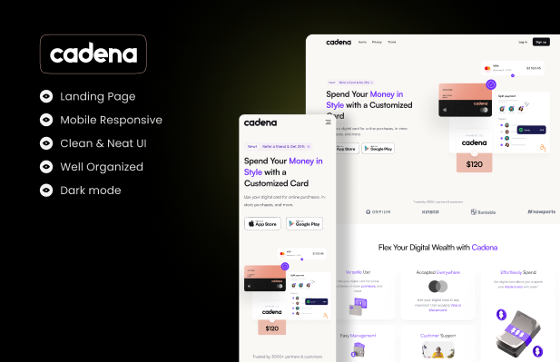

<h1 align="center">Cadena</h1>
<div align="center">

</div>

## 📔 Sobre
O Cadena é um website distinto que tem como objetivo primordial proporcionar a disponibilidade de cartões digitais personalizados, repleto de atributos vantajosos que abrangem uma variedade de utilidades. Estes benefícios incluem, mas não se limitam a:

- Versatilidade notável, permitindo a adaptação do cartão a diversas finalidades.

- Universalidade de aceitação, conferindo-lhe a capacidade de ser utilizado em estabelecimentos variados.

- Gerenciamento simplificado, proporcionando aos usuários a habilidade de administrar seus cartões com facilidade e eficiência.

- Suporte dedicado ao cliente, assegurando que as necessidades e indagações dos usuários sejam prontamente atendidas.

O Cadena se destaca como um serviço que oferece cartões digitais personalizados, enriquecendo tal oferta com atributos como a adaptabilidade versátil, ampla aceitação, gerenciamento descomplicado e assistência ao cliente de qualidade.

## 🔨 Ferramentas
- [HTML](https://www.w3schools.com/TAGS/default.asp)
- [CSS](https://developer.mozilla.org/en-US/docs/Web/CSS)
- [JavaScript](https://developer.mozilla.org/en-US/docs/Web/JavaScript)

## 🔁 Como Rodar o Projeto

Se você deseja executar este projeto localmente, siga as etapas abaixo:

- **Faça o dowload do projeto clicando no botão "Code" no GitHub e logo após em "Dowload ZIP".Depois basta extrair os arquivos da pasta compactada e abrir o arquivo `index.html`.**
     <p align="center"><strong>ou</strong></p>

1. **Clone o repositório:**

    Abra o terminal e execute o seguinte comando para clonar este repositório:

    ```bash
    git clone https://github.com/William-Klein7/Cadena.git
    ```
   

2. **Navegue até a pasta do projeto;**

3. **Abra o projeto no navegador:**

    Agora você pode abrir o arquivo `index.html` no seu navegador favorito para ver o projeto em ação.


## 💡 Contribuição
Se você deseja fazer contribuições ou adicionar recursos ao projeto, não hesite em fazer um fork do repositório, fazer suas alterações e enviar um pull request.
